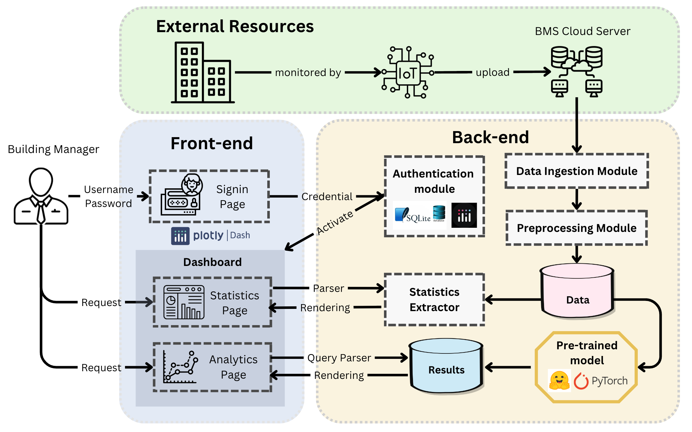

# Building Time Series Analytics (BiTSA)

## Overview

**BiTSA** (Building Time Series Analytics) is an advanced tool design for building managers to efficiently manage energy consumption, predict future trends, and gain insights into building operations. BiTSA will integrate IoT-generated Building Management Systems (BMS) data to provide actionable forecasts, statistical summaries, and more. With its user-friendly interface, robust backend, and customizable forecasting models, BiTSA aims to revolutionize energy management for modern buildings.

)

Click here for our demostration [[video](https://youtu.be/GbF3cA5GsSc)]

## Motivation

Incorporating AI technologies into digital infrastructure offers transformative potential for energy management, particularly in enhancing energy efficiency and supporting net-zero objectives. However, the complexity of IoT-generated datasets often poses a significant challenge, hindering the translation of research insights into practical, real-world applications.

BiTSA, is equipped with time-series (TS) foundation models to bridge this gap. The tool enables building managers to interpret complex energy data quickly and take immediate, data-driven actions based on real-time insights. By integrating advanced forecasting models with an intuitive visual interface, our solution facilitates proactive decision-making, optimizes energy consumption, and promotes sustainable building management practices.

## Capabilities of BiTSA
- Provides an interactive visualization platform, enabling managers to interpret complex IoT-generated infrastructure data efficiently.

- Utilizes pre-trained time-series models to analyze pre-processed data, delivering insights based on historical trends to assist in future energy planning.

- Bridges the gap between academic research and practical industry applications by integrating cutting-edge AI technologies, making advanced energy forecasting accessible to building managers and facility operators.

## Key Features

- **Time Series Forecasting**: Perform future trend analysis using various state-of-the-art models, including DLinear, PatchTST, and One-Fits-All.
- **Customizable Models**: Pre-trained models ready for different forecasting horizons and granularity.
- **Data Integration**: Seamlessly integrates with cloud-based Building Management Systems (BMS) following the Brick Schema protocol.
- **Visualization Dashboard**: Interactive and dynamic visualizations allow for in-depth analysis without needing to refresh or send new requests.
- **Statistics & Trends**: Provides comprehensive statistical summaries of building performance over custom time periods.

## Architecture

### Front-end

The front-end interfaces are built using [Dash Plotly](https://dash.plotly.com/) to provide an interactive dashboard experience. The user can log in, request statistical summaries, and perform time-series forecasting directly through the dashboard.

`Homepage`:
- `About US`: Introduce the background, motivation, and capability of the BiTSA design.
- `Sign In`: A system entry that identifies the users' credentials to access the functionality.
- `Sign Up`: A register page for user to allocate their identical information in the backend database.

Once successfully signed in to the system, users can access their dashboard, where the structure tree is as follows:

`Dashboard`: The main entry point for the software dashboard.
- `Data Card`: Contains files related to the upload functionality, such as a page to upload files and validate them.
- `Building Overview`: Contains files that handle the statistics section, such as rendering statistics pages and generating graphs or summaries.
- `Analytics`: Contains files that handle the forecasting section, including model loading and graph creation for forecasting results.

### Back-end

`Data Ingestion Module`:
`Preprocessing Module`:

`Pre-trained Models`: BiTSA supports forecasting models including
- `Naive Methods`: Copy Last Day, Historical Average
- `Deep Learning Methods`: [DLinear](https://arxiv.org/abs/2205.13504), [PatchTST](https://arxiv.org/abs/2211.14730), [Informer](https://arxiv.org/abs/2012.07436), [iTransformer](https://arxiv.org/abs/2310.06625)
- `Foundation Models`: [OneFitsAll](https://arxiv.org/abs/2302.11939)

`Results Database`:

## Related Works
- A Gap in Time: The Challenge of Processing Heterogeneous IoT Point Data in Buildings [[ArXiv](https://arxiv.org/abs/2405.14267)]
- BTS: Building Timeseries Dataset: Empowering Large-Scale Building Analytics [[ArXiv](https://arxiv.org/html/2406.08990v1)]
- Brick by Brick: Automating Building Data Classification [[Competition Document](https://racefor2030.com.au/wp-content/uploads/2024/08/DIEF-Competition-1-Flyer-v06.pdf)]

## Access

The BiTSA is not a public access design, to customize and extend the BiTSA, please contact xxxxxxxx@unsw.edu.au for further information. 

