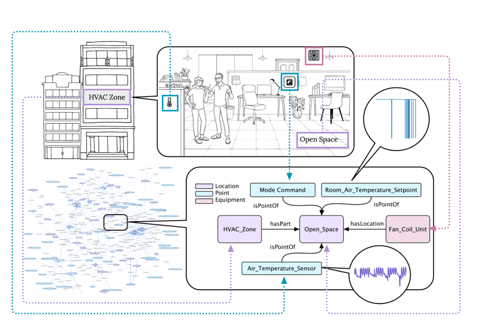

# Building Time Series Analytics (BiTSA)

## Overview

**BiTSA** (Building Time Series Analytics) is an advanced tool design for building managers to efficiently manage energy consumption, predict future trends, and gain insights into building operations. BiTSA will integrate IoT-generated Building Management Systems (BMS) data to provide actionable forecasts, statistical summaries, and more. With its user-friendly interface, robust backend, and customizable forecasting models, BiTSA aims to revolutionize energy management for modern buildings.

Check our demonstration [[video]()] here.

## Motivation

## Key Features

- **Time Series Forecasting**: Perform future trend analysis using various state-of-the-art models, including DLinear, PatchTST, and One-Fits-All.
- **Customizable Models**: Pre-trained models ready for different forecasting horizons and granularity.
- **Data Integration**: Seamlessly integrates with cloud-based Building Management Systems (BMS) following the Brick Schema protocol.
- **Visualization Dashboard**: Interactive and dynamic visualizations allow for in-depth analysis without needing to refresh or send new requests.
- **Statistics & Trends**: Provides comprehensive statistical summaries of building performance over custom time periods.

## Architecture

### Front-end

The front-end interfaces are built using [Dash Plotly](https://dash.plotly.com/) to provide an interactive dashboard experience. The user can log in, request statistical summaries, and perform time-series forecasting directly through the dashboard.

`Homepage`:
- `About US`: Introduce the background, motivation, and capability of the BiTSA design.
- `Sign In`: A system entry that identifies the users' credentials to access the functionality.
- `Sign Up`: A register page for user to allocate their identical information in the backend database.

Once successfully signed in to the system, users can access their dashboard, where the structure tree is as followed:

`Dashboard`: The main entry point for the software dashboard.
- `Data Card`: Contains files related to the upload functionality, such as a page to upload files and validate them.
- `Building Overview`: Contains files that handle the statistics section, such as rendering statistics pages and generating graphs or summaries.
- `Analytics`: Contains files that handle the forecasting section, including model loading and graph creation for forecasting results.\

### Back-end

`Data Ingestion Module`:
`Preprocessing Module`:
`Pre-trained Models`:
`Results Database`:

## Access

The BiTSA is not a public access design, to customize and extend the BiTSA, please contact xxxxxxxx@unsw.edu.au for further information. 

